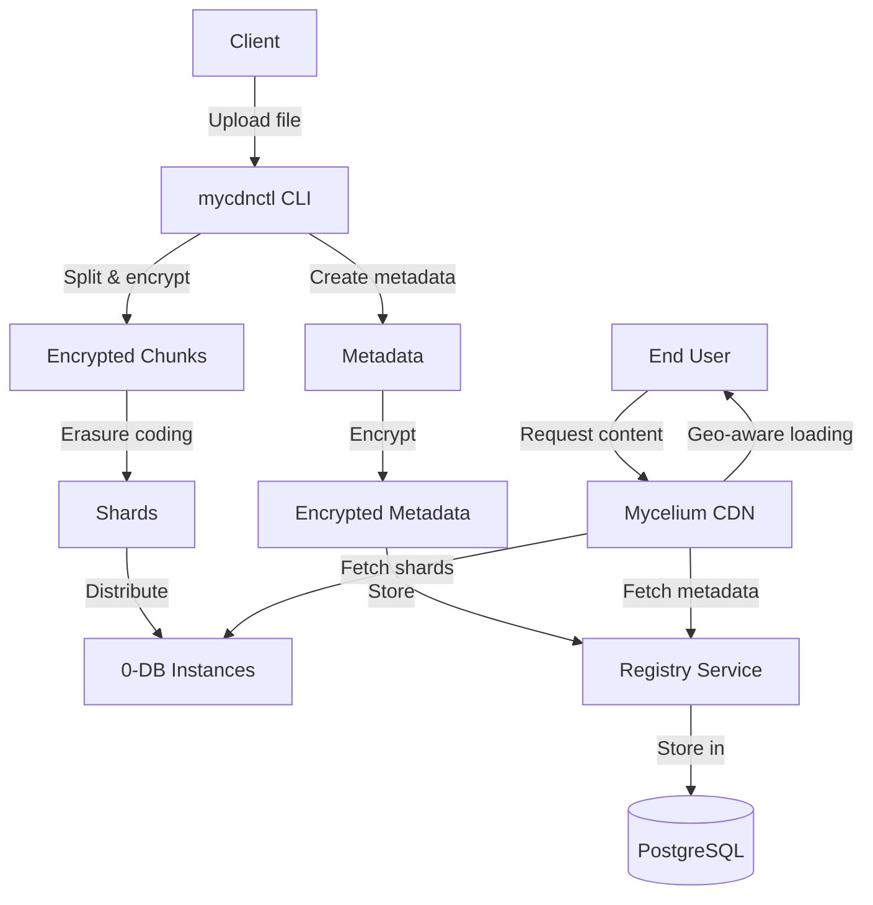
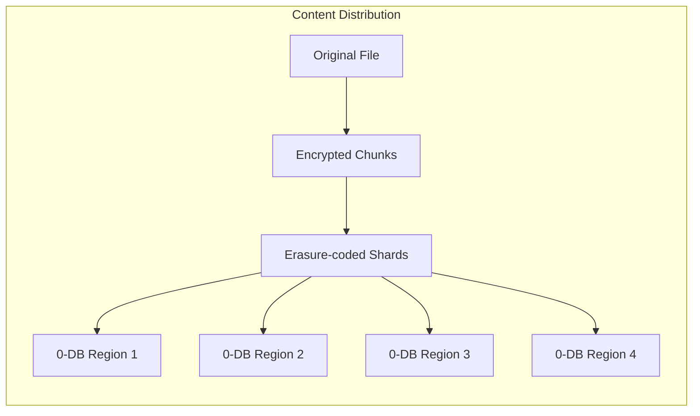
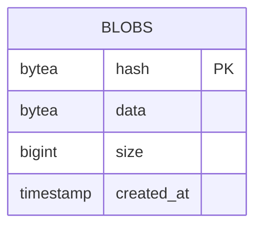
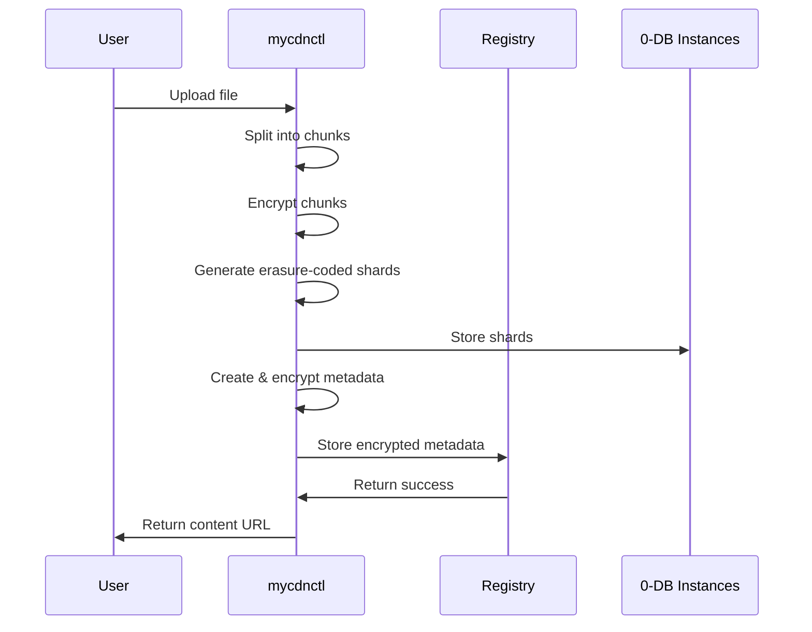
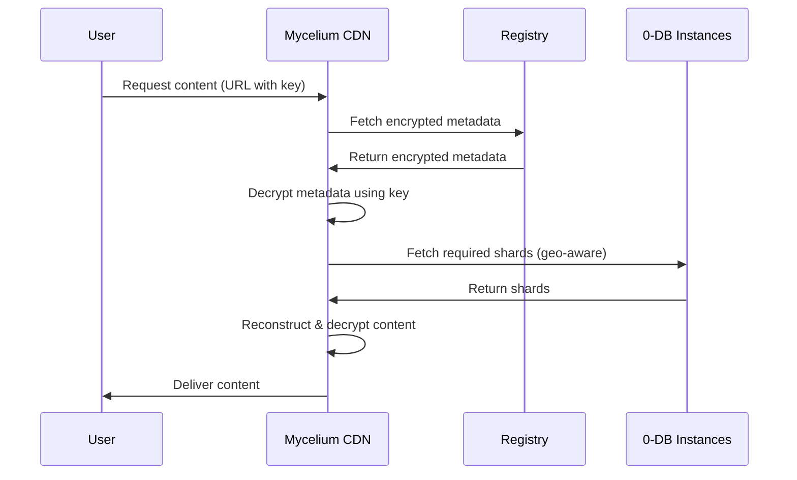

# Mycelium CDN Registry

The Mycelium CDN Registry is a system for storing and retrieving object metadata in a distributed content delivery network. It consists of three main components:

1. **cdn-meta**: A library that defines the metadata format for objects
2. **mycdnctl**: A command-line tool for uploading objects to the CDN
3. **registry**: A service for storing and retrieving metadata

## System Architecture



## Table of Contents

- [User Guide: Using mycdnctl](#user-guide-using-mycdnctl)
- [Administrator Guide: Running the Registry](#administrator-guide-running-the-registry)
- [Developer Documentation: Metadata Format](#developer-documentation-metadata-format)
  - [Binary Encoding](#binary-encoding)
  - [Encryption](#encryption)
  - [Storage Architecture](#storage-architecture)

## User Guide: Using mycdnctl

The `mycdnctl` tool allows you to upload files and directories to the Mycelium CDN. The uploaded content is split into chunks, encrypted, and distributed across multiple 0-DB instances using Reed-Solomon erasure coding for redundancy.

### Installation

The `mycdnctl` tool is written in Rust and can be built from source:

```bash
cd crates/mycdnctl
cargo build --release
```

### Configuration

Before using `mycdnctl`, you need to create a configuration file (default: `config.toml`) that specifies the 0-DB instances to use for storage. Here's an example configuration:

```toml
# Number of shards required to recover the data (minimum)
required_shards = 3

# List of 0-DB instances to store shards
[[zdbs]]
host = "192.168.1.1:9900"
namespace = "mycelium"
secret = "optional-password"

[[zdbs]]
host = "192.168.1.2:9900"
namespace = "mycelium"
secret = "optional-password"

[[zdbs]]
host = "192.168.1.3:9900"
namespace = "mycelium"
secret = "optional-password"

[[zdbs]]
host = "192.168.1.4:9900"
namespace = "mycelium"
```

The configuration specifies:
- `required_shards`: The minimum number of shards needed to recover the data
- `zdbs`: A list of 0-DB instances to store the shards, each with:
  - `host`: The host address and port of the 0-DB instance
  - `namespace`: The namespace to use in the 0-DB
  - `secret`: An optional password for the namespace

### Uploading Files

To upload a file to the CDN:

```bash
mycdnctl upload --config config.toml path/to/file.txt
```

Optional parameters:
- `--mime`: Specify the MIME type of the file (otherwise inferred)
- `--name`: Specify a custom name for the file (otherwise uses the filename)
- `--chunk-size`: Specify the size of chunks (default: 5 MiB, range: 1-5 MiB)
- `--include-password`: Include 0-DB namespace passwords in the metadata (not recommended for public content)
- `--registry`: Specify the registry URL (default: https://cdn.mycelium.io)

### Uploading Directories

To upload a directory to the CDN:

```bash
mycdnctl upload --config config.toml path/to/directory
```

This will upload all files in the directory (non-recursive) and create a directory metadata object that references all the files.

### Understanding the Output

After uploading an object, `mycdnctl` will output a URL for accessing the object, which can be used when running mycelium
locally:

```
Object path/to/file.txt saved. Url: https://[encrypted-hash].cdn.mycelium.io/?key=[plaintext-hash]
```

The URL contains:
- The encrypted hash as a subdomain
- The plaintext hash as a query parameter, which serves as the decryption key

## Administrator Guide: Running the Registry

The registry service stores and serves metadata blobs. It uses PostgreSQL for storage and provides a simple HTTP API.

### Prerequisites

- PostgreSQL database server
- Rust toolchain for building the service

### Building the Registry

```bash
cd crates/registry
cargo build --release
```

### Database Setup

1. Create a PostgreSQL database:

```sql
CREATE DATABASE mycelium_cdn_registry;
CREATE USER mycelium WITH PASSWORD 'your-password';
GRANT ALL PRIVILEGES ON DATABASE mycelium_cdn_registry TO mycelium;
```

The registry service will automatically create the necessary tables on startup.

### Running the Registry

```bash
./target/release/registry \
  --db-user mycelium \
  --db-password your-password \
  --db-name mycelium_cdn_registry \
  --db-host localhost \
  --db-port 5432
```

The registry service will:
1. Connect to the PostgreSQL database
2. Run any necessary migrations
3. Start an HTTP server on port 8080

### API Endpoints

The registry provides two main API endpoints:

- `POST /api/v1/metadata`: Upload a metadata blob
- `GET /api/v1/metadata/{hash}`: Retrieve a metadata blob by its hash

See the [OpenAPI specification](crates/registry/openapi.yaml) for detailed API documentation.

## Developer Documentation: Metadata Format

### Binary Encoding

The metadata format is defined in the `cdn-meta` crate. It uses a binary encoding with the following structure:

1. Magic bytes: `MCDN` (4 bytes)
2. Version: `1` (1 byte)
3. Bincode-encoded metadata (variable length)

The metadata is encoded using Bincode with big-endian byte order and fixed integer encoding.

### Metadata Types

The metadata can be one of two types:

1. **File**: Represents a single file with the following fields:
   - `content_hash`: Hash of the unencrypted file content (32 bytes)
   - `name`: Name of the file (UTF-8 string)
   - `mime`: Optional MIME type (UTF-8 string)
   - `blocks`: List of blocks that make up the file

2. **Directory**: Represents a directory with the following fields:
   - `files`: List of file metadata hashes and optional decryption keys
   - `name`: Name of the directory (UTF-8 string)

### Block Structure

Each file is split into blocks, which are then encrypted, erasure-coded, and distributed across multiple 0-DB instances. A block has the following fields:

- `shards`: List of locations where the shards are stored
- `required_shards`: Minimum number of shards needed to recover the block
- `start_offset`: Offset in bytes where this block starts in the file
- `end_offset`: Offset in bytes where this block ends in the file
- `content_hash`: Hash of the block data in plaintext
- `encrypted_hash`: Hash of the block data after encryption
- `nonce`: Nonce used for encryption (12 bytes)

### Shard Location

Each shard is stored in a 0-DB instance with the following location information:

- `host`: 0-DB host IP address and port
- `namespace`: 0-DB namespace
- `secret`: Optional namespace password

### Encryption

The system uses AES-256-GCM for encryption:

1. **File Content Encryption**:
   - Each block of file content is encrypted using AES-256-GCM
   - The encryption key is the Blake3 hash of the plaintext block
   - A random 12-byte nonce is generated for each block
   - The encrypted data and nonce are stored in the metadata

2. **Metadata Encryption**:
   - The metadata itself is also encrypted using AES-256-GCM
   - The encryption key is the Blake3 hash of the plaintext metadata
   - A random 12-byte nonce is generated and appended to the encrypted metadata
   - The encrypted metadata is stored in the registry under its Blake3 hash

### Storage Architecture

The system uses a combination of technologies for storage:

1. **0-DB**: A distributed key-value store used for storing the actual file content shards
   - Each shard is stored under the hash of the encrypted block
   - Reed-Solomon erasure coding is used to generate redundant shards
   - Only `required_shards` out of the total shards are needed to recover the data
   - Multiple 0-DB instances are used for both redundancy and geo-aware loading in mycelium



2. **PostgreSQL**: Used by the registry service to store encrypted metadata blobs
   - Each blob is stored under its Blake3 hash
   - The database schema includes fields for the hash, data, size, and creation timestamp



3. **DNS-based Content Addressing**: The system uses DNS subdomains for content addressing
   - The encrypted hash is used as a subdomain
   - The plaintext hash (decryption key) is passed as a query parameter

### Data Flow





This architecture provides:
- **Security**: Content is encrypted both at rest and in transit
- **Redundancy**: Reed-Solomon erasure coding ensures data can be recovered even if some shards are lost
- **Geo-awareness**: Content is loaded from the closest available 0-DB instances
- **Scalability**: Content is distributed across multiple storage nodes
- **Efficiency**: Content-addressed storage prevents duplication
