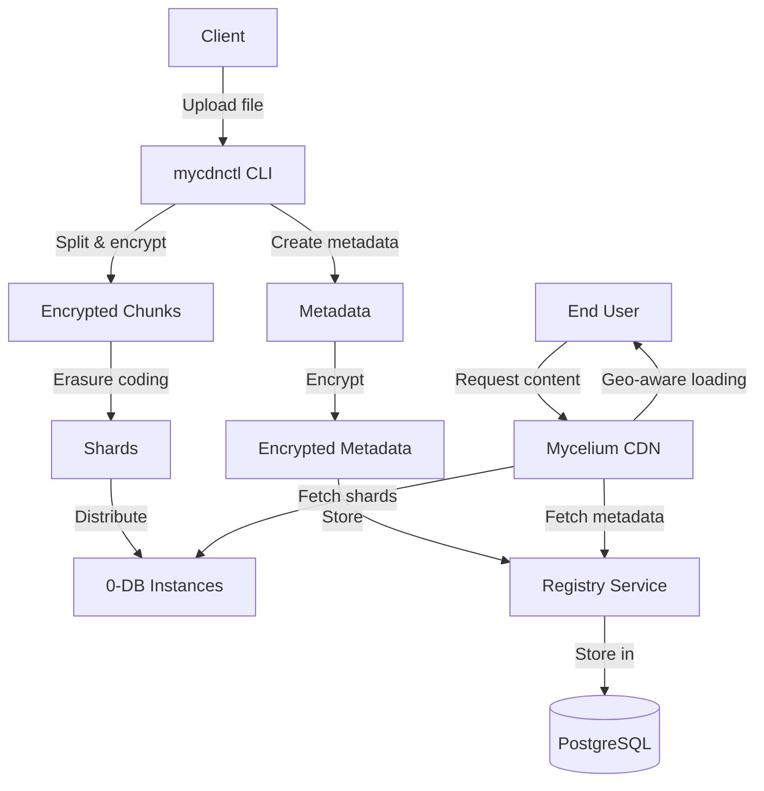

# Mycelium CDN Registry

The Mycelium CDN Registry is a system for storing and retrieving object metadata in a distributed content delivery network. This repo consists of three main components:

1. **cdn-meta**: A library that defines the metadata format for objects
2. **mycdnctl**: A command-line tool for uploading objects to the CDN
3. **registry**: A service for storing and retrieving metadata

## System Architecture



## Using mycdnctl

The `mycdnctl` tool is the primary tool needed by users to interract with the mycelium
CDN. This tool allows you to upload files and directories to the Mycelium CDN. The
uploaded content is split into chunks, encrypted, and distributed across multiple
0-DB instances using Reed-Solomon erasure coding for redundancy.

### Installation

Either download an artifact for your platform from the latest release, or build from source.

The `mycdnctl` tool is written in Rust and can be built from source:

```bash
cd crates/mycdnctl
cargo build --release
```

### Configuration

Before using `mycdnctl`, you need to create a configuration file (default: `config.toml`) that specifies the 0-DB instances to use for storage. Here's an example configuration:

```toml
# Number of shards required to recover the data (minimum)
required_shards = 3

# List of 0-DB instances to store shards
[[zdbs]]
host = "192.168.1.1:9900"
namespace = "mycelium"
secret = "optional-password"

[[zdbs]]
host = "192.168.1.2:9900"
namespace = "mycelium"
secret = "optional-password"

[[zdbs]]
host = "192.168.1.3:9900"
namespace = "mycelium"
secret = "optional-password"

[[zdbs]]
host = "192.168.1.4:9900"
namespace = "mycelium"
```

The configuration specifies:
- `required_shards`: The minimum number of shards needed to recover the data
- `zdbs`: A list of 0-DB instances to store the shards, each with:
  - `host`: The host address and port of the 0-DB instance
  - `namespace`: The namespace to use in the 0-DB
  - `secret`: An optional password for the namespace

### Uploading Files

To upload a file to the CDN:

```bash
mycdnctl upload --config config.toml path/to/file.txt
```

Optional parameters:
- `--mime`: Specify the MIME type of the file (otherwise inferred)
- `--name`: Specify a custom name for the file (otherwise uses the filename)
- `--chunk-size`: Specify the size of chunks (default: 5 MiB, range: 1-5 MiB)
- `--include-password`: Include 0-DB namespace passwords in the metadata (not recommended for public content)
- `--registry`: Specify the registry URL (default: https://cdn.mycelium.grid.tf)

### Uploading Directories

To upload a directory to the CDN:

```bash
mycdnctl upload --config config.toml path/to/directory
```

This will upload all files in the directory (non-recursive) and create a directory metadata object that references all the files.

### Understanding the Output

After uploading an object, `mycdnctl` will output a URL for accessing the object, which can be used when running mycelium
locally:

```
Object path/to/file.txt saved. Url: http://[encrypted-hash].[registry-url]/?key=[plaintext-hash]
```

The URL contains:
- The encrypted hash as a subdomain
- The plaintext hash as a query parameter, which serves as the decryption key
