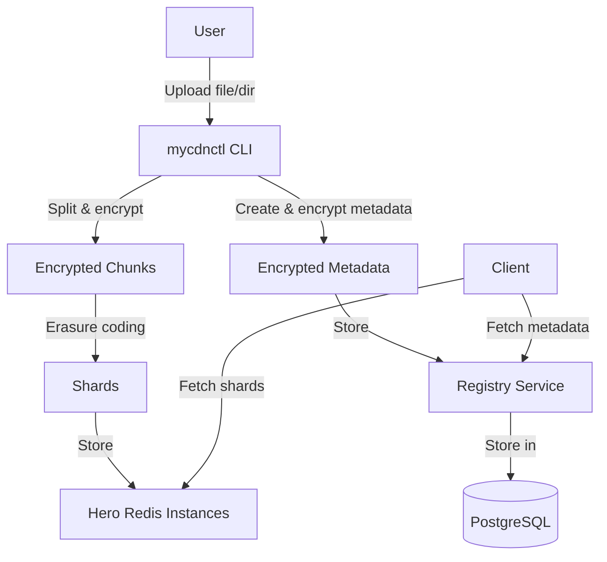
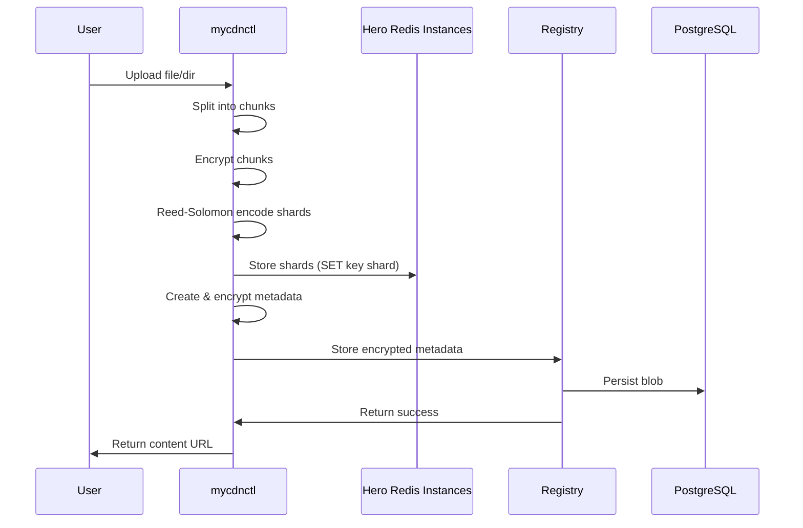
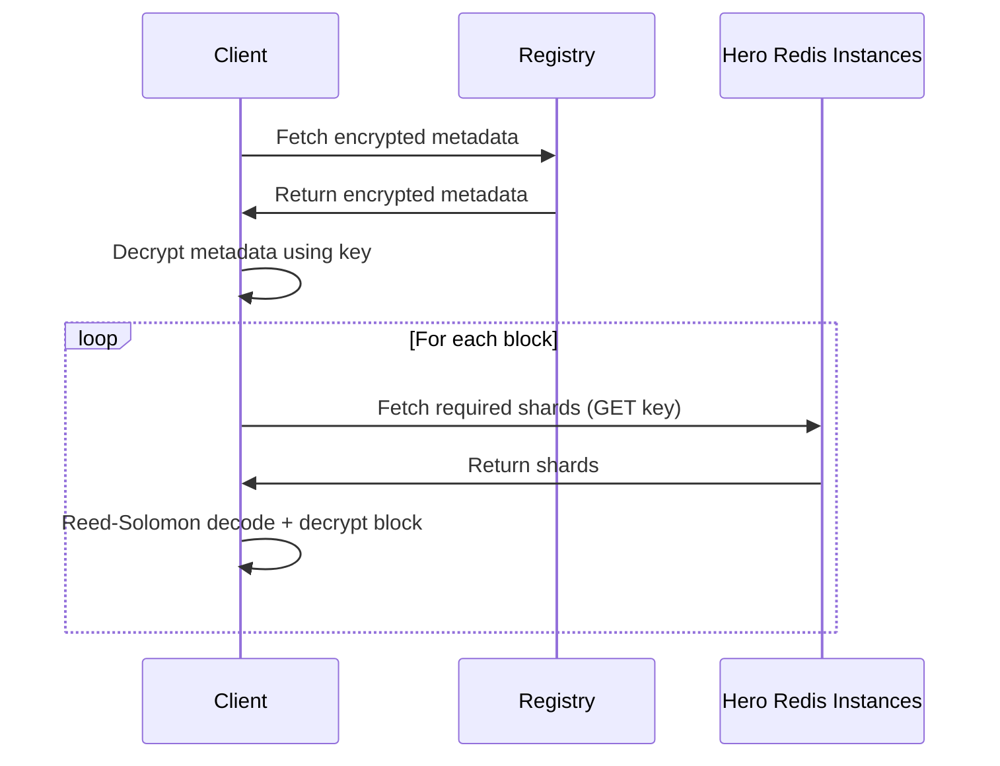

# Mycelium CDN Registry Documentation

This directory contains the documentation for the Mycelium CDN Registry system, including user guides, administrator guides, and technical specifications.

## System Overview

The repository contains three main components:

1. `cdn-meta`: Defines the metadata format (binary encoding + encryption inputs/outputs)
2. `mycdnctl`: CLI tool that uploads objects by chunking/encrypting/erasure-coding, then storing shards in **Hero Redis**
3. `registry`: Service for storing and retrieving encrypted metadata blobs (backed by PostgreSQL)

## System Architecture



## Documentation Overview

### User Documentation

- [**User Guide: Using mycdnctl**](mycdnctl-user-guide.md) — How to build/configure/use `mycdnctl` to upload files and directories. (Note: some diagrams/text may still mention the old backend; the storage backend is now Hero Redis.)

### Administrator Documentation

- [**Administrator Guide: Running the Registry**](registry-admin-guide.md) — How to deploy and operate the metadata registry service (PostgreSQL-backed).

### Developer Documentation

- [**Technical Specification: Metadata Format**](metadata-technical-spec.md) — Details the metadata format, binary encoding, encryption, and erasure coding.

### Configuration Examples

- [**Sample Configuration**](sample-config.toml) — Example `config.toml` for `mycdnctl` showing how to configure Hero Redis shard backends.

## Data Flow

### Upload Flow



### Download Flow (High-Level)



## Quick Start

### Build `mycdnctl`

From the repository root:

```bash
cargo build --release --manifest-path crates/mycdnctl/Cargo.toml
```

### Build and run the registry

```bash
cargo build --release --manifest-path crates/registry/Cargo.toml
./target/release/registry --help
```

### Upload a file

```bash
./target/release/mycdnctl upload --config config.toml path/to/file.txt
```

## Notes on Hero Redis

Hero Redis is Redis-protocol compatible, but authentication is typically done via:

- `AUTH <token>` (session token), and optionally `SELECT <db>`
- or an Ed25519-based flow (`CHALLENGE` → `TOKEN` → `AUTH`), depending on how your Hero Redis instance is configured

`mycdnctl` stores shards by using `SET <key> <bytes>` where `<key>` is derived from the encrypted block hash.

---
If you find any remaining outdated references to the previous shard storage backend in this docs folder, update them to “Hero Redis”.