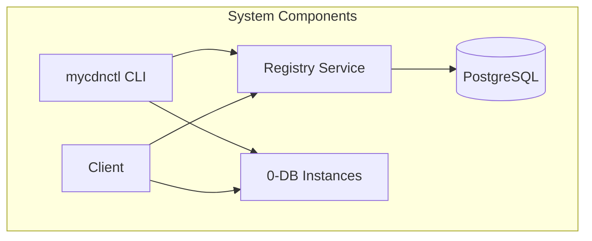
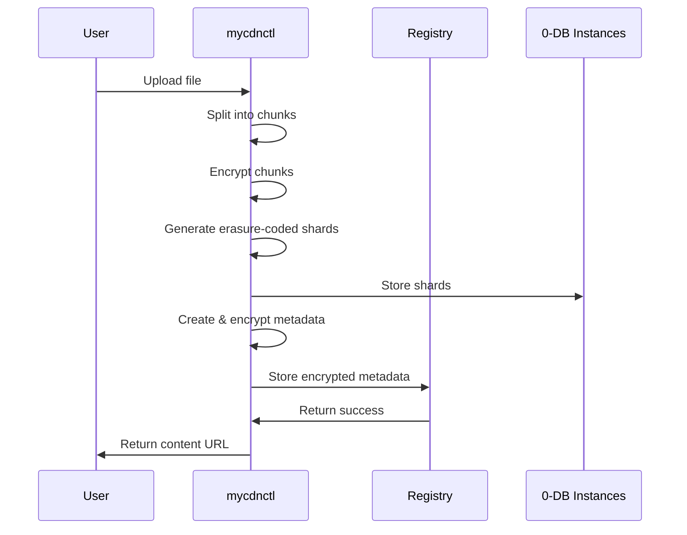
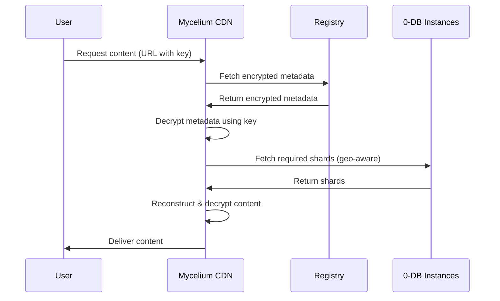

# Mycelium CDN Registry Documentation

Welcome to the Mycelium CDN Registry documentation. This documentation provides comprehensive information about the Mycelium CDN Registry system, including user guides, administrator guides, and technical specifications.



## Documentation Overview

### User Documentation

- [**User Guide: Using mycdnctl**](mycdnctl-user-guide.md) - Detailed instructions on how to use the mycdnctl command-line tool to upload files and directories to the Mycelium CDN. Includes diagrams of the upload workflow, erasure coding process, and security model.

### Administrator Documentation

- [**Administrator Guide: Running the Registry**](registry-admin-guide.md) - Instructions for setting up and running the Mycelium CDN Registry service, including database configuration, deployment options, and monitoring. Features diagrams for scaling and architecture.

### Developer Documentation

- [**Technical Specification: Metadata Format**](metadata-technical-spec.md) - Detailed technical specification of the metadata format, binary encoding, encryption, and storage architecture used in the Mycelium CDN system. Includes class diagrams, flow charts, and sequence diagrams.

### Configuration Examples

- [**Sample Configuration**](sample-config.toml) - A sample configuration file for mycdnctl with detailed comments, showing how to configure 0-DB instances across different geographic regions for both redundancy and geo-aware loading.

## System Architecture

The Mycelium CDN Registry consists of three main components:

1. **cdn-meta**: A library that defines the metadata format for objects
2. **mycdnctl**: A command-line tool for uploading objects to the CDN
3. **registry**: A service for storing and retrieving metadata

### Data Flow



1. **Upload Process**:
   - Files are split into chunks
   - Chunks are encrypted using AES-256-GCM
   - Encrypted chunks are erasure-coded using Reed-Solomon
   - Shards are distributed across multiple 0-DB instances in different geographic regions
   - Metadata is created, encrypted, and stored in the registry



2. **Download Process**:
   - Encrypted metadata is retrieved from the registry
   - Metadata is decrypted using the provided key
   - Shards are retrieved from the closest available 0-DB instances (geo-aware loading)
   - Original file is reconstructed from the shards

## Quick Start

### Installing mycdnctl

```bash
cargo build --release -p mycdnctl
```

### Setting Up the Registry

```bash
# Create PostgreSQL database
createdb mycelium_cdn_registry

# Build and run the registry
cargo build --release -p registry
./target/release/registry --db-user mycelium --db-password your-password
```

### Uploading a File

```bash
mycdnctl upload --config config.toml path/to/file.txt
```

## Additional Resources

- [Main README](../README.md) - Overview of the entire project
- [GitHub Repository](https://github.com/your-org/mycelium-cdn-registry) - Source code and issue tracking