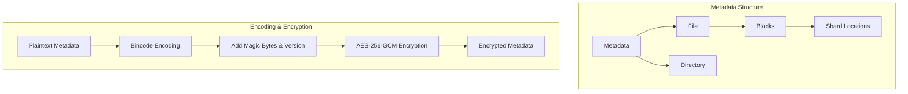
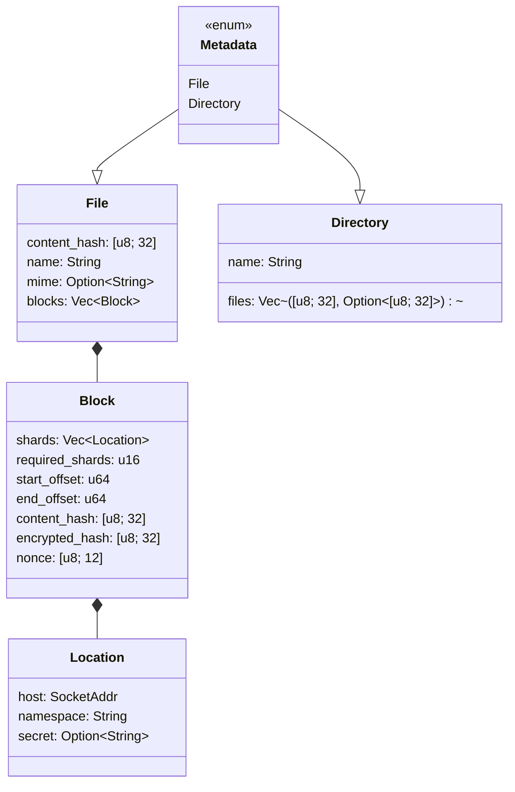
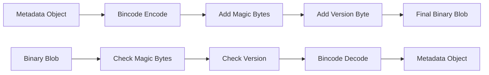
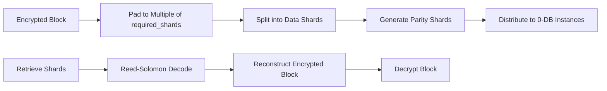
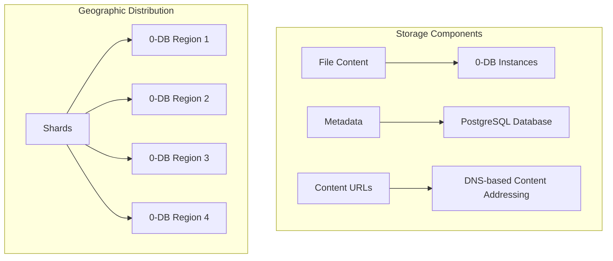
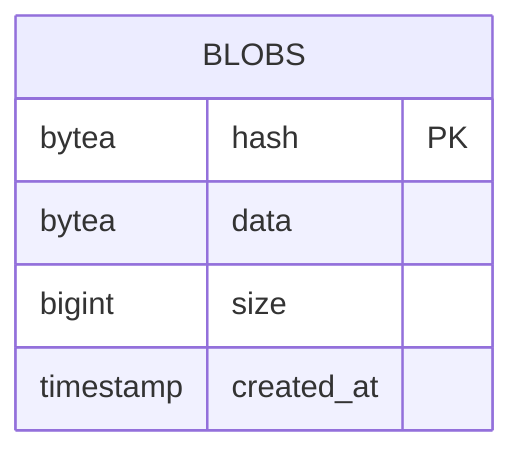
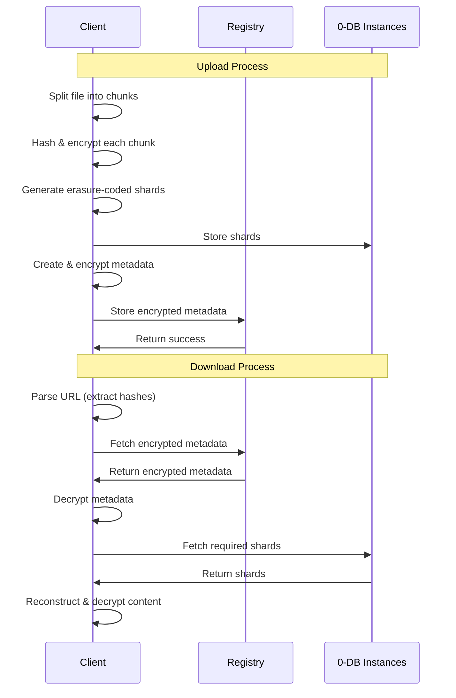

# Mycelium CDN Metadata Technical Specification

This document provides a detailed technical specification of the metadata format, binary encoding, encryption, and storage architecture used in the Mycelium CDN system. It is intended for developers who need to understand the internals of the system or implement compatible clients.



## Table of Contents

- [Metadata Format](#metadata-format)
  - [Binary Structure](#binary-structure)
  - [Metadata Types](#metadata-types)
- [Binary Encoding](#binary-encoding)
- [Encryption](#encryption)
  - [Content Encryption](#content-encryption)
  - [Metadata Encryption](#metadata-encryption)
  - [Key Derivation](#key-derivation)
- [Erasure Coding](#erasure-coding)
- [Storage Architecture](#storage-architecture)
- [Client Implementation Guide](#client-implementation-guide)

## Metadata Format

### Binary Structure

The metadata binary format consists of:

1. Magic bytes: `MCDN` (4 bytes)
2. Version: `1` (1 byte)
3. Bincode-encoded metadata (variable length)

```
+--------+--------+----------------------+
| Magic  | Version| Bincode-encoded data |
| 4 bytes| 1 byte | Variable length      |
+--------+--------+----------------------+
```

### Metadata Types

The metadata can be one of two types:

1. **File**: Represents a single file with fields for:
   - Content hash (32 bytes)
   - File name
   - Optional MIME type
   - List of blocks that make up the file

2. **Directory**: Represents a directory with fields for:
   - List of file metadata hashes and optional decryption keys
   - Directory name



The full structure definitions can be found in the `cdn-meta` crate source code.

## Binary Encoding

The Mycelium CDN uses Bincode for binary serialization of metadata structures, with a specific format:

```
+--------+--------+----------------------+
| Magic  | Version| Bincode-encoded data |
| 4 bytes| 1 byte | Variable length      |
+--------+--------+----------------------+
```

- **Magic bytes**: `MCDN` (4 bytes)
- **Version**: `1` (1 byte)
- **Bincode configuration**: Big-endian byte order with fixed integer encoding



## Encryption

The Mycelium CDN uses AES-256-GCM for encryption of both file content and metadata.

```mermaid
flowchart TD
    subgraph "Content Encryption"
        A[File Content Block] --> B[Blake3 Hash]
        B --> C[Use Hash as AES Key]
        C --> D[Generate Random Nonce]
        D --> E[AES-256-GCM Encrypt]
        E --> F[Encrypted Block]
    end
    
    subgraph "Metadata Encryption"
        G[Metadata Binary] --> H[Blake3 Hash]
        H --> I[Use Hash as AES Key]
        I --> J[Generate Random Nonce]
        J --> K[AES-256-GCM Encrypt]
        K --> L[Append Nonce]
        L --> M[Encrypted Metadata]
    end
```



### Content Encryption

File content is encrypted at the block level:

1. Each block of file content is hashed using Blake3
2. The hash is used as the encryption key for AES-256-GCM
3. A random 12-byte nonce is generated for each block
4. The block is encrypted using AES-256-GCM with the key and nonce
5. The encrypted block is then erasure-coded and distributed

### Metadata Encryption

Metadata is also encrypted:

1. The metadata is serialized to binary format
2. The binary blob is hashed using Blake3
3. The hash is used as the encryption key for AES-256-GCM
4. A random 12-byte nonce is generated
5. The metadata is encrypted using AES-256-GCM with the key and nonce
6. The nonce is appended to the encrypted metadata
7. The encrypted metadata with appended nonce is stored in the registry

### Key Derivation

The encryption keys are derived directly from the content being encrypted:

1. For file content: The key is the Blake3 hash of the plaintext block
2. For metadata: The key is the Blake3 hash of the plaintext metadata

This approach has several advantages:
- No need to store or transmit encryption keys separately
- Content-based encryption ensures identical content is encrypted identically
- The hash serves as both an identifier and an encryption key

## Erasure Coding

The Mycelium CDN uses Reed-Solomon erasure coding to provide redundancy for stored data.



The system uses the `reed_solomon_erasure` crate with the Galois field GF(2^8). With `k` required shards and `n` total shards:

1. The encrypted block is padded to ensure its length is a multiple of `k`
2. The padded block is split into `k` equal-sized data shards
3. `n - k` parity shards are generated using Reed-Solomon encoding
4. Each shard (both data and parity) is uploaded to a different 0-DB instance

To recover the original data, only `k` out of `n` shards are needed, providing fault tolerance against the loss of up to `n - k` shards.

## Storage Architecture



### 0-DB Storage

The actual file content is stored in 0-DB instances:

1. 0-DB is a Redis-compatible key-value store
2. Each shard is stored under the hash of the encrypted block
3. The system connects to 0-DB using the Redis protocol
4. Authentication is handled using the SECURE challenge-response mechanism
5. Multiple 0-DB instances are used for both redundancy and geo-aware loading in mycelium

### Registry Storage

Metadata is stored in a PostgreSQL database with a simple schema:



### Content Addressing

The system uses content-addressed storage with a URL format:
```
https://[encrypted-hash].[registry-domain]/?key=[plaintext-hash]
```

Where:
- `[encrypted-hash]` is the hex-encoded Blake3 hash of the encrypted metadata
- `[registry-domain]` is the domain of the registry (e.g., `cdn.mycelium.io`)
- `[plaintext-hash]` is the hex-encoded Blake3 hash of the plaintext metadata, which is also the decryption key

## Client Implementation Guide



### Uploading Content

To implement a client for uploading content:

1. **Split the file into chunks** (default: 5 MiB)
2. **For each chunk**:
   - Hash the chunk using Blake3
   - Encrypt the chunk using AES-256-GCM with the hash as the key
   - Generate Reed-Solomon shards
   - Upload each shard to a different 0-DB instance
3. **Create metadata** and upload to the registry

### Downloading Content

To implement a client for downloading content:

1. **Parse the URL** to extract the encrypted and plaintext hashes
2. **Retrieve and decrypt the metadata** from the registry
3. **For each block in the metadata**:
   - Retrieve shards from 0-DB instances
   - Reconstruct and decrypt the block
   - Verify and append to the output file
4. **Verify the complete file** against the content hash