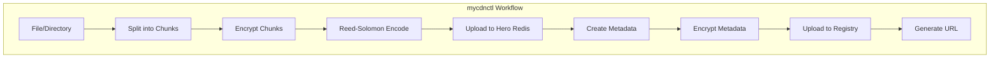
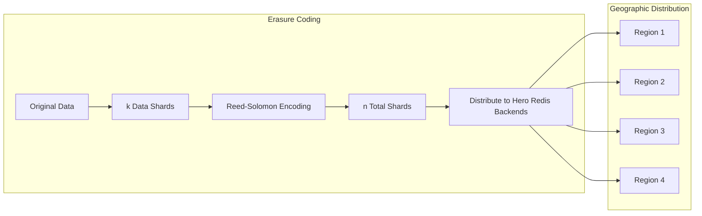
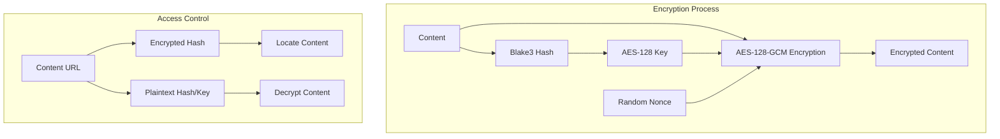

# mycdnctl User Guide

`mycdnctl` is a command-line tool for uploading files and directories to the Mycelium CDN. This guide provides detailed instructions on how to install, configure, and use the tool.



## Installation

### Prerequisites

- Rust toolchain (rustc, cargo)
- Access to Hero Redis instances for shard storage
- Access to a Mycelium CDN Registry instance

### Building from Source

1. Clone the repository:
   ```bash
   git clone https://github.com/your-org/mycelium-cdn-registry.git
   cd mycelium-cdn-registry
   ```

2. Build the tool:
   ```bash
   cd crates/mycdnctl
   cargo build --release
   ```

3. The binary will be available at `target/release/mycdnctl`

## Configuration

Before using `mycdnctl`, you need to create a configuration file that specifies the Hero Redis backends to use for shard storage.

### Configuration File Format

The configuration file uses TOML format and should contain:

1. `required_shards`: The minimum number of shards needed to recover the data
2. `backends`: A list of Hero Redis backends to store shards (one shard is sent to each backend)

Example `config.toml`:

```toml
# Number of shards required to recover the data (minimum)
required_shards = 3

# List of Hero Redis backends to store shards
# One shard is sent to each backend in this list
[[backends]]
kind = "hero_redis"
host = "192.168.1.1:6379"
db = 7

[[backends]]
kind = "hero_redis"
host = "192.168.1.2:6379"
db = 7

[[backends]]
kind = "hero_redis"
host = "192.168.1.3:6379"
db = 7

[[backends]]
kind = "hero_redis"
host = "192.168.1.4:6379"
db = 7

# Optional auth:
# 1) Session token (uses `AUTH <token>`)
# auth = { type = "token", token = "your-session-token" }
#
# 2) Ed25519 private key (client performs CHALLENGE/TOKEN/AUTH)
# private_key must be 64 hex chars (32 bytes)
# auth = { type = "private_key", private_key = "e5f6a7b8... (64 hex chars total)" }
```

### Configuration Parameters

- `required_shards`: The minimum number of shards needed to recover the data. This must be <= the total number of configured backends.
- `backends`: A list of Hero Redis backends, each with:
  - `kind`: Must be `hero_redis`
  - `host`: The host address and port of the Hero Redis instance (format: `IP:PORT`)
  - `db`: Database number to `SELECT` after connecting/authenticating
  - `auth` (optional): Authentication configuration:
    - `{ type = "token", token = "..." }` uses `AUTH <token>`
    - `{ type = "private_key", private_key = "..." }` performs `CHALLENGE/TOKEN/AUTH` using the given Ed25519 private key (64 hex chars / 32 bytes)

### Reed-Solomon Erasure Coding



The tool uses Reed-Solomon erasure coding to provide redundancy. With `n` Hero Redis backends and `k` required shards:

- The data is split into `k` data shards
- `n - k` parity shards are generated
- Any `k` shards out of the total `n` shards can be used to reconstruct the original data

This provides two key benefits:
1. **Fault tolerance**: Even if `n - k` backends are unavailable, the data can still be recovered
2. **Geo-aware loading**: A downloader can retrieve shards from the closest available Hero Redis backends, improving performance across geographic regions

## Basic Usage

### Uploading a File

To upload a file to the CDN:

```bash
mycdnctl upload --config config.toml path/to/file.txt
```

This will:
1. Read and hash the file
2. Split the file into chunks (default: 5 MiB)
3. Encrypt each chunk using AES-128-GCM
4. Apply Reed-Solomon erasure coding to generate shards
5. Upload the shards to the Hero Redis backends
6. Create and encrypt metadata
7. Upload the metadata to the registry
8. Output a URL for accessing the file

### Uploading a Directory

To upload a directory to the CDN:

```bash
mycdnctl upload --config config.toml path/to/directory
```

This will:
1. Upload each file in the directory (non-recursive)
2. Create a directory metadata object that references all the files
3. Output a URL for accessing the directory

## Advanced Options

### Specifying MIME Type

By default, `mycdnctl` tries to infer the MIME type from the file content or extension. You can override this with the `--mime` option:

```bash
mycdnctl upload --config config.toml --mime "application/pdf" path/to/file.pdf
```

### Custom Object Name

By default, `mycdnctl` uses the filename as the object name. You can specify a custom name with the `--name` option:

```bash
mycdnctl upload --config config.toml --name "custom-name.txt" path/to/file.txt
```

### Chunk Size

You can specify the size of chunks with the `--chunk-size` option (in bytes, range: 1-5 MiB):

```bash
mycdnctl upload --config config.toml --chunk-size 2097152 path/to/file.txt
```

Smaller chunks may be more efficient for small files or when network conditions are poor, while larger chunks reduce overhead for large files.

### Including Auth in Metadata

By default, `mycdnctl` does not include Hero Redis authentication in the metadata. This means your Hero Redis instances must be publicly accessible (at least for reads) for users to download the content.

If you want to include a configured Hero Redis session token in the metadata, use the `--include-password` flag:

```bash
mycdnctl upload --config config.toml --include-password path/to/file.txt
```

Notes:
- This only includes a token when `auth.type = "token"` is configured for a backend.
- Private keys (`auth.type = "private_key"`) are never embedded in metadata.

**Warning**: Including tokens in the metadata means anyone who can access the metadata may be able to access your Hero Redis shard storage. Use this option only for private content, or when you fully understand the implications.

### Custom Registry URL

By default, `mycdnctl` uses `https://cdn.mycelium.grid.tf` as the registry URL. You can specify a different registry with the `--registry` option:

```bash
mycdnctl upload --config config.toml --registry https://custom-registry.example.com path/to/file.txt
```

## Understanding the Output

After uploading an object, `mycdnctl` will output a URL for accessing the object:

```
Object path/to/file.txt saved. Url: https://[encrypted-hash].cdn.mycelium.io/?key=[plaintext-hash]
```

The URL contains:
- The encrypted hash as a subdomain
- The plaintext hash as a query parameter, which serves as the decryption key

### URL Format

The URL format is:

```
https://[encrypted-hash].[registry-domain]/?key=[plaintext-hash]
```

Where:
- `[encrypted-hash]` is the hex-encoded Blake3 hash of the encrypted metadata
- `[registry-domain]` is the domain of the registry (e.g., `cdn.mycelium.io`)
- `[plaintext-hash]` is the hex-encoded Blake3 hash of the plaintext metadata, which is also the decryption key

## Security Considerations



### Encryption

- File content is encrypted using AES-128-GCM
- The encryption key is the Blake3 hash of the plaintext content
- Metadata is also encrypted using AES-128-GCM
- The encryption key for metadata is the Blake3 hash of the plaintext metadata

### Access Control

- Anyone with the full URL (including the key parameter) can access and decrypt the content
- Without the key parameter, the content remains encrypted
- If you include Hero Redis session tokens in the metadata, anyone with the URL can access your Hero Redis shard storage (depending on server ACLs)

## Troubleshooting

### Connection Issues

If you encounter connection issues with Hero Redis instances:

1. Verify that the Hero Redis instances are running and accessible
2. Check that the host addresses, ports, and `db` values in the configuration are correct
3. If `auth` is configured, verify that the token/private key is correct and that the server allows the requested operations

### Registry Issues

If you encounter issues with the registry:

1. Verify that the registry URL is correct and accessible
2. Check that the registry service is running
3. Ensure that you have permission to upload to the registry

### File Size Limitations

The tool has some limitations on file sizes:

- Maximum chunk size: 5 MiB
- Minimum chunk size: 1 MiB
- Very large files may take a long time to upload and process

If you need to upload very large files, consider:
- Using a larger chunk size (up to 5 MiB)
- Ensuring stable network connections to all Hero Redis backends
- Splitting the file into smaller files if possible
