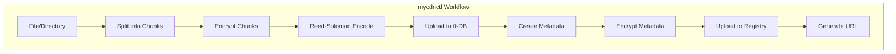
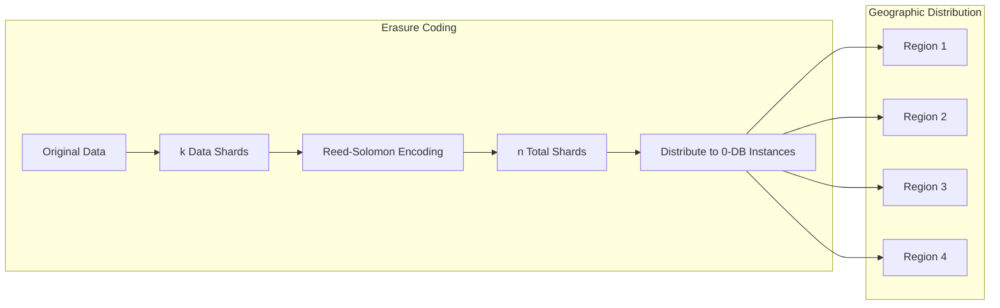

# mycdnctl User Guide

`mycdnctl` is a command-line tool for uploading files and directories to the Mycelium CDN. This guide provides detailed instructions on how to install, configure, and use the tool.



## Installation

### Prerequisites

- Rust toolchain (rustc, cargo)
- Access to 0-DB instances for storage
- Access to a Mycelium CDN Registry instance

### Building from Source

1. Clone the repository:
   ```bash
   git clone https://github.com/your-org/mycelium-cdn-registry.git
   cd mycelium-cdn-registry
   ```

2. Build the tool:
   ```bash
   cd crates/mycdnctl
   cargo build --release
   ```

3. The binary will be available at `target/release/mycdnctl`

## Configuration

Before using `mycdnctl`, you need to create a configuration file that specifies the 0-DB instances to use for storage.

### Configuration File Format

The configuration file uses TOML format and should contain:

1. `required_shards`: The minimum number of shards needed to recover the data
2. `zdbs`: A list of 0-DB instances to store the shards

Example `config.toml`:

```toml
# Number of shards required to recover the data (minimum)
required_shards = 3

# List of 0-DB instances to store shards
[[zdbs]]
host = "192.168.1.1:9900"
namespace = "mycelium"
secret = "optional-password"

[[zdbs]]
host = "192.168.1.2:9900"
namespace = "mycelium"
secret = "optional-password"

[[zdbs]]
host = "192.168.1.3:9900"
namespace = "mycelium"
secret = "optional-password"

[[zdbs]]
host = "192.168.1.4:9900"
namespace = "mycelium"
```

### Configuration Parameters

- `required_shards`: The minimum number of shards needed to recover the data. This should be less than the total number of 0-DB instances.
- `zdbs`: A list of 0-DB instances, each with:
  - `host`: The host address and port of the 0-DB instance (format: `IP:PORT`)
  - `namespace`: The namespace to use in the 0-DB
  - `secret`: An optional password for the namespace

### Reed-Solomon Erasure Coding



The tool uses Reed-Solomon erasure coding to provide redundancy. With `n` 0-DB instances and `k` required shards:

- The data is split into `k` data shards
- `n - k` parity shards are generated
- Any `k` shards out of the total `n` shards can be used to reconstruct the original data

This provides two key benefits:
1. **Fault tolerance**: Even if `n - k` 0-DB instances are unavailable, the data can still be recovered
2. **Geo-aware loading**: Mycelium can retrieve shards from the closest available 0-DB instances, improving performance for users in different geographic regions

## Basic Usage

### Uploading a File

To upload a file to the CDN:

```bash
mycdnctl upload --config config.toml path/to/file.txt
```

This will:
1. Read and hash the file
2. Split the file into chunks (default: 5 MiB)
3. Encrypt each chunk using AES-256-GCM
4. Apply Reed-Solomon erasure coding to generate shards
5. Upload the shards to the 0-DB instances
6. Create and encrypt metadata
7. Upload the metadata to the registry
8. Output a URL for accessing the file

### Uploading a Directory

To upload a directory to the CDN:

```bash
mycdnctl upload --config config.toml path/to/directory
```

This will:
1. Upload each file in the directory (non-recursive)
2. Create a directory metadata object that references all the files
3. Output a URL for accessing the directory

## Advanced Options

### Specifying MIME Type

By default, `mycdnctl` tries to infer the MIME type from the file content or extension. You can override this with the `--mime` option:

```bash
mycdnctl upload --config config.toml --mime "application/pdf" path/to/file.pdf
```

### Custom Object Name

By default, `mycdnctl` uses the filename as the object name. You can specify a custom name with the `--name` option:

```bash
mycdnctl upload --config config.toml --name "custom-name.txt" path/to/file.txt
```

### Chunk Size

You can specify the size of chunks with the `--chunk-size` option (in bytes, range: 1-5 MiB):

```bash
mycdnctl upload --config config.toml --chunk-size 2097152 path/to/file.txt
```

Smaller chunks may be more efficient for small files or when network conditions are poor, while larger chunks reduce overhead for large files.

### Including Passwords

By default, `mycdnctl` does not include 0-DB namespace passwords in the metadata. This means the 0-DB namespaces must be publicly accessible for users to download the content.

If you want to include the passwords in the metadata (which allows accessing private namespaces), use the `--include-password` flag:

```bash
mycdnctl upload --config config.toml --include-password path/to/file.txt
```

**Warning**: Including passwords in the metadata means anyone who can access the metadata will have access to your 0-DB namespaces. Use this option only for private content.

### Custom Registry URL

By default, `mycdnctl` uses `https://cdn.mycelium.io` as the registry URL. You can specify a different registry with the `--registry` option:

```bash
mycdnctl upload --config config.toml --registry https://custom-registry.example.com path/to/file.txt
```

## Understanding the Output

After uploading an object, `mycdnctl` will output a URL for accessing the object:

```
Object path/to/file.txt saved. Url: https://[encrypted-hash].cdn.mycelium.io/?key=[plaintext-hash]
```

The URL contains:
- The encrypted hash as a subdomain
- The plaintext hash as a query parameter, which serves as the decryption key

### URL Format

The URL format is:

```
https://[encrypted-hash].[registry-domain]/?key=[plaintext-hash]
```

Where:
- `[encrypted-hash]` is the hex-encoded Blake3 hash of the encrypted metadata
- `[registry-domain]` is the domain of the registry (e.g., `cdn.mycelium.io`)
- `[plaintext-hash]` is the hex-encoded Blake3 hash of the plaintext metadata, which is also the decryption key

## Security Considerations


### Encryption

- File content is encrypted using AES-256-GCM
- The encryption key is the Blake3 hash of the plaintext content
- Metadata is also encrypted using AES-256-GCM
- The encryption key for metadata is the Blake3 hash of the plaintext metadata

### Access Control

- Anyone with the full URL (including the key parameter) can access and decrypt the content
- Without the key parameter, the content remains encrypted
- If you include 0-DB namespace passwords in the metadata, anyone with the URL can access your 0-DB namespaces

## Troubleshooting

### Connection Issues

If you encounter connection issues with 0-DB instances:

1. Verify that the 0-DB instances are running and accessible
2. Check that the host addresses and ports in the configuration are correct
3. Ensure that the namespaces exist and the passwords are correct

### Registry Issues

If you encounter issues with the registry:

1. Verify that the registry URL is correct and accessible
2. Check that the registry service is running
3. Ensure that you have permission to upload to the registry

### File Size Limitations

The tool has some limitations on file sizes:

- Maximum chunk size: 5 MiB
- Minimum chunk size: 1 MiB
- Very large files may take a long time to upload and process

If you need to upload very large files, consider:
- Using a larger chunk size (up to 5 MiB)
- Ensuring stable network connections to all 0-DB instances
- Splitting the file into smaller files if possible
