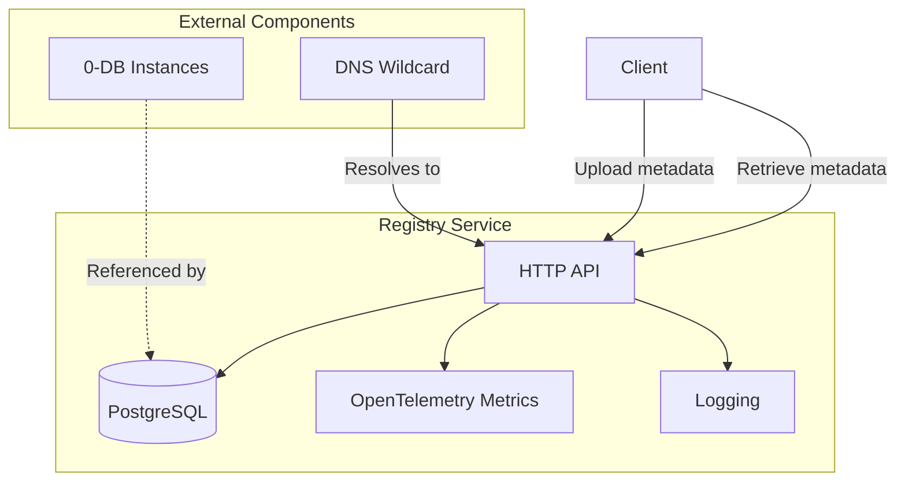
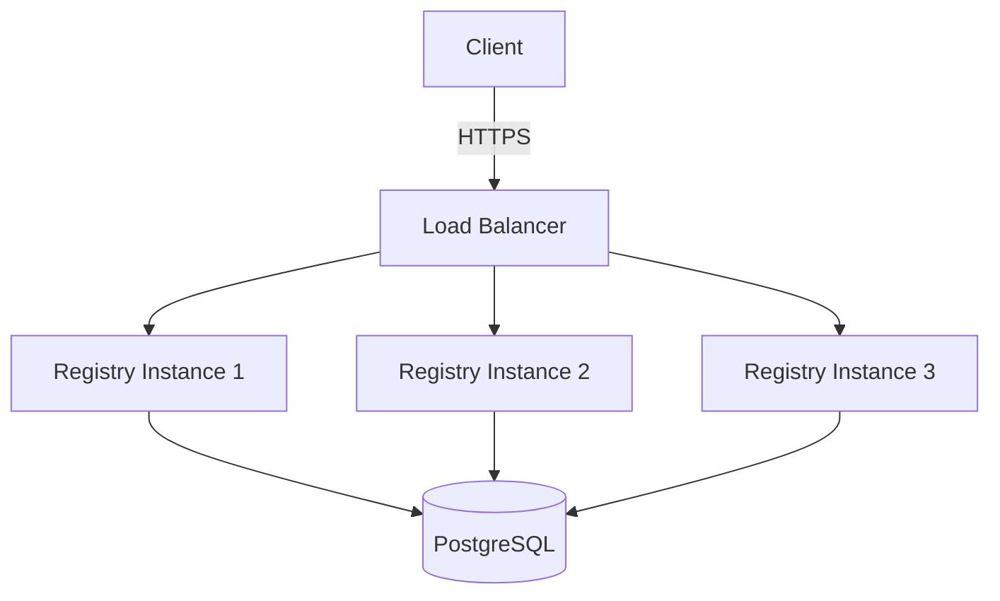
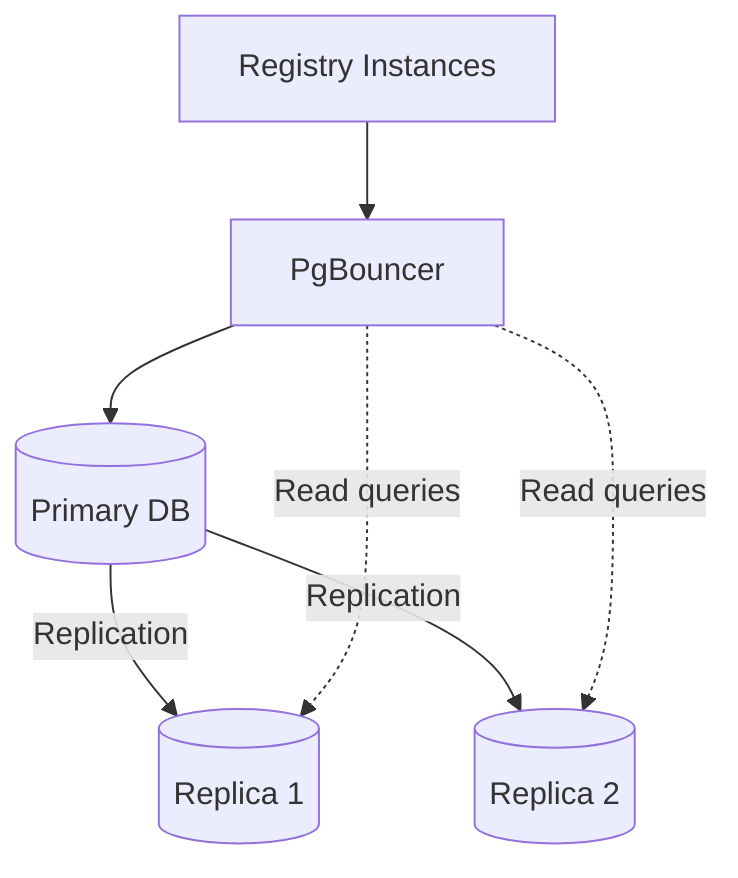

# Mycelium CDN Registry Administrator Guide

This guide provides detailed instructions for setting up and running the Mycelium CDN Registry service, which is responsible for storing and serving metadata blobs for the Mycelium CDN.

## Overview

The Mycelium CDN Registry is a service that:
- Stores encrypted metadata blobs in a PostgreSQL database
- Provides an HTTP API for uploading and retrieving metadata
- Works in conjunction with 0-DB instances that store the actual file content



## Prerequisites

- PostgreSQL 12+ database server
- Rust toolchain (rustc, cargo) for building the service
- Linux or macOS environment (Windows may work but is not officially supported)
- Network connectivity for clients to access the registry

## Building the Registry

### From Source

1. Clone the repository:
   ```bash
   git clone https://github.com/your-org/mycelium-cdn-registry.git
   cd mycelium-cdn-registry
   ```

2. Build the registry service:
   ```bash
   cd crates/registry
   cargo build --release
   ```

3. The binary will be available at `target/release/registry`

## Database Setup

### Creating the PostgreSQL Database

1. Install PostgreSQL if not already installed:
   ```bash
   # Ubuntu/Debian
   sudo apt update
   sudo apt install postgresql postgresql-contrib
   
   # CentOS/RHEL
   sudo yum install postgresql-server postgresql-contrib
   sudo postgresql-setup initdb
   sudo systemctl start postgresql
   sudo systemctl enable postgresql
   
   # macOS (using Homebrew)
   brew install postgresql
   brew services start postgresql
   ```

2. Connect to PostgreSQL as the postgres user:
   ```bash
   sudo -u postgres psql
   ```

3. Create a database and user for the registry:
   ```sql
   CREATE DATABASE mycelium_cdn_registry;
   CREATE USER mycelium WITH PASSWORD 'your-secure-password';
   GRANT ALL PRIVILEGES ON DATABASE mycelium_cdn_registry TO mycelium;
   \c mycelium_cdn_registry
   GRANT ALL ON SCHEMA public TO mycelium;
   ```

4. Exit the PostgreSQL prompt:
   ```sql
   \q
   ```

### Database Schema

The registry service will automatically create the necessary tables on startup. The main table is:

- `blobs`: Stores the metadata blobs with columns:
  - `hash`: The Blake3 hash of the blob (primary key)
  - `data`: The actual blob data
  - `size`: The size of the blob in bytes
  - `created_at`: Timestamp when the blob was created

## Running the Registry

### Command-Line Options

The registry service accepts the following command-line options:

- `--db-user`: Username for PostgreSQL authentication (required)
- `--db-password`: Password for PostgreSQL authentication (required)
- `--db-name`: Name of the PostgreSQL database (default: `mycelium_cdn_registry`)
- `--db-host`: Hostname of the PostgreSQL server (default: `localhost`)
- `--db-port`: Port of the PostgreSQL server (default: `5432`)

### Basic Usage

Run the registry service with:

```bash
./target/release/registry \
  --db-user mycelium \
  --db-password your-secure-password \
  --db-name mycelium_cdn_registry \
  --db-host localhost \
  --db-port 5432
```

The service will:
1. Connect to the PostgreSQL database
2. Run any necessary migrations
3. Start an HTTP server on port 8080

### Running as a Systemd Service

For production deployments, it's recommended to run the registry as a systemd service:

1. Create a systemd service file:
   ```bash
   sudo vim /etc/systemd/system/mycelium-cdn-registry.service
   ```

2. Add the following content:
   ```ini
   [Unit]
   Description=Mycelium CDN Registry Service
   After=network.target postgresql.service
   
   [Service]
   User=mycelium
   Group=mycelium
   ExecStart=/path/to/registry \
     --db-user mycelium \
     --db-password your-secure-password \
     --db-name mycelium_cdn_registry \
     --db-host localhost \
     --db-port 5432
   Restart=on-failure
   
   [Install]
   WantedBy=multi-user.target
   ```

3. Create a system user for the service:
   ```bash
   sudo useradd -r -s /bin/false mycelium
   ```

4. Enable and start the service:
   ```bash
   sudo systemctl daemon-reload
   sudo systemctl enable mycelium-cdn-registry
   sudo systemctl start mycelium-cdn-registry
   ```

5. Check the service status:
   ```bash
   sudo systemctl status mycelium-cdn-registry
   ```

## API Endpoints

The registry provides a simple HTTP API as defined in the [OpenAPI specification](../../crates/registry/openapi.yaml). The main endpoints are:

- `POST /api/v1/metadata`: Upload a metadata blob
- `GET /api/v1/metadata/{hash}`: Retrieve a metadata blob by its hash

For detailed API documentation, refer to the OpenAPI specification which includes request/response formats, status codes, and examples.

Example using curl to upload metadata:
```bash
curl -X POST \
  http://localhost:8080/api/v1/metadata \
  -F "data=@/path/to/metadata.bin"
```

Example using curl to retrieve metadata:
```bash
curl -X GET \
  http://localhost:8080/api/v1/metadata/1a2b3c4d5e6f7a8b9c0d1e2f3a4b5c6d7e8f9a0b1c2d3e4f5a6b7c8d9e0f1a2b \
  --output metadata.bin
```

## DNS Configuration

For the Mycelium CDN to work properly, you need to configure wildcard DNS records:

1. Create a wildcard A/AAAA record pointing to your registry server:
   ```
   *.cdn.mycelium.io. IN A 203.0.113.1
   ```

2. This allows URLs like `https://[hash].cdn.mycelium.io/` to resolve to your registry server

## Monitoring and Logging

The registry service includes OpenTelemetry integration for monitoring and tracing.

### Logs

Logs are output to stdout/stderr and can be captured by systemd or redirected to a file.

To view logs for the systemd service:
```bash
sudo journalctl -u mycelium-cdn-registry
```

### Metrics

The service exports metrics in OpenTelemetry format. You can configure an OpenTelemetry collector to receive these metrics and forward them to your monitoring system.

## Backup and Recovery

### Database Backup

Regular backups of the PostgreSQL database are recommended:

```bash
pg_dump -U mycelium mycelium_cdn_registry > backup.sql
```

### Database Recovery

To restore from a backup:

```bash
psql -U mycelium mycelium_cdn_registry < backup.sql
```

## Scaling

### Horizontal Scaling

For high-availability and load balancing:



1. Run multiple instances of the registry service
2. Use a load balancer (e.g., HAProxy, Nginx) to distribute traffic
3. Ensure all instances connect to the same PostgreSQL database or a replicated cluster

### Database Scaling

For large deployments:



1. Configure PostgreSQL replication for read scaling
2. Consider using PostgreSQL connection pooling (e.g., PgBouncer)
3. Implement database sharding for very large datasets

## Troubleshooting

### Common Issues

1. **Database Connection Failures**:
   - Verify PostgreSQL is running: `sudo systemctl status postgresql`
   - Check credentials and connection parameters
   - Ensure the database exists and the user has appropriate permissions

2. **HTTP Server Issues**:
   - Check if the port is already in use: `sudo lsof -i :8080`
   - Verify network firewall settings allow access to port 8080
   - Check for errors in the service logs

3. **Performance Issues**:
   - Monitor database performance with `pg_stat_statements`
   - Check disk I/O and CPU usage
   - Consider increasing database connection pool size

### Diagnostic Commands

Check if the service is running:
```bash
ps aux | grep registry
```

Test the API endpoint:
```bash
curl -v http://localhost:8080/api/v1/metadata/1a2b3c4d5e6f7a8b9c0d1e2f3a4b5c6d7e8f9a0b1c2d3e4f5a6b7c8d9e0f1a2b
```

Check database connectivity:
```bash
psql -U mycelium -h localhost -d mycelium_cdn_registry -c "SELECT 1"
```

## Security Considerations

### Database Security

- Use strong, unique passwords for database users
- Restrict database access to only the necessary hosts
- Enable SSL for database connections in production
- Regularly update PostgreSQL to patch security vulnerabilities

### API Security

- Implement rate limiting to prevent abuse
- Consider adding authentication for metadata uploads
- Use HTTPS for all API endpoints
- Validate input parameters to prevent injection attacks

### System Security

- Keep the operating system and all dependencies updated
- Use a firewall to restrict access to only necessary ports
- Run the service with minimal privileges
- Implement monitoring and alerting for suspicious activities
